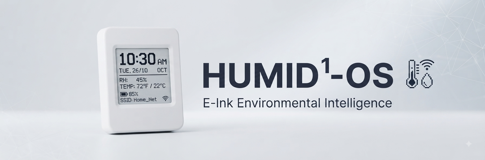

# Humid1-OS: Ecosystem & Cloud Infrastructure

  

  

> [!WARNING]
> **Project Under Construction:** The `HUMID1-OS` repository and its associated cloud and hardware integration are currently under active development. Features, code structures, and documentation are subject to change.

> [!NOTE]
> **Professional Scope:** Designed by **Humiditron**, the `HUMID1-OS` architecture is engineered to demonstrate production-grade IoT competencies, bridging low-level embedded systems with modern cloud-native server administration. It serves as a comprehensive portfolio piece highlighting full-stack ownership—from bare-metal microcontroller firmware to secure cloud orchestration and zero-touch OTA pipelines.

---

## 1. Project Overview & Ecosystem Scope

`HUMID1-OS` is a community-driven, open-source, IoT-enabled humidor monitoring ecosystem built for precise, low-maintenance environmental control.

* **Author:** Humiditron *(also heard as HYOO-mi-DEE-tron)*
* **Ecosystem Domain:** [Humid1.com](https://www.humid1.com/)
* **Backend Infrastructure:** ThingsBoard IoT server.
* **Core Strategy:** Standardizing on a single, off-the-shelf hardware target to eliminate fragmentation, supply chain overhead, and custom debugging complexity. Devices are flashed once during setup, with subsequent configuration and lifecycle updates handled seamlessly Over-The-Air (OTA) via ThingsBoard.
* **Future Vision:** Opening up the platform for public use as a free service supporting standard hardware.

### Core Engineering Pillars
* **Embedded Firmware & Hardware Integration:** Direct peripheral management on the ESP32-S3 architecture, handling power profiles, I2C sensor polling (`SHTC3`), real-time clock synchronization, and low-power e-Paper display rendering.
* **Cloud Infrastructure & DevOps:** End-to-end self-hosting implementation utilizing ThingsBoard as the IoT backend, orchestrated via Docker, secured behind a reverse proxy on a dedicated VPS.
* **Zero-Touch Maintainability:** Design focus on lifecycle management, utilizing automated Over-The-Air (OTA) deployment strategies and Bluetooth-based provisioning to eliminate friction post-deployment.

---

## 2. Hardware Target & Technical Specifications

`HUMID1-OS` standardizes on the **Waveshare ESP32-S3-ePaper-1.54G** (V2 hardware platform) **SKU:32298**, featuring integrated low-power peripherals tailored for sealed environment monitoring.

### Hardware Specifications (V2 Board)
* **Microcontroller:** ESP32-S3-PICO-1-N8R8 SoC (Xtensa 32-bit LX7 dual-core processor operating up to 240MHz, with integrated 8MB Flash and 8MB PSRAM in a stacked package).
* **Display:** 1.54-inch 2-color BW (Black, White) e-Paper panel with a 200x200 resolution, offering ultra-low power consumption and sunlight readability.
* **Environmental Sensor:** Onboard SHTC3 temperature and humidity sensor connected via shared I2C (GPIO47/48, address `0x70`).
* **Real-Time Clock (RTC):** Onboard PCF85063 RTC chip for precise time management.
* **Audio Codec:** Low-power ES8311 audio codec chip with microphone and speaker support.
* **Storage:** TF card slot (must be formatted as FAT32).

### Critical Board-Specific Power & GPIO Wiring
To ensure proper operation under deep-sleep states, the firmware accounts for specific hardware circuit requirements:
* **Battery Power Latch (GPIO17):** Must be driven `HIGH` during boot and frozen via deep-sleep pin holds to maintain the power latch when the physical power button is released.
* **Panel Power (GPIO6):** Inverted power rail where `LOW` enables power to the e-Paper panel and `HIGH` powers it down during sleep to eliminate idle draw while preserving the image on screen.
* **Wake Pin (GPIO18):** Connected to the physical `PWR` button (active-low with pull-up) to allow on-demand wake cycles.

---

## 3. Firmware Architecture, Provisioning & Power Management

The firmware operates on an optimized **Wake-Read-Refresh-Sleep** duty cycle designed to maximize battery longevity on portable deployments.

* **Duty Cycle:** Wakes up at defined intervals (e.g., every 30 minutes) to poll sensors, update the display once, sync time via SNTP, and return to deep sleep.
* **Device Provisioning:** Utilizes **Bluetooth Low Energy (BLE)** for seamless, secure initial device provisioning and Wi-Fi credential setup, eliminating cumbersome AP configuration modes.
* **UI Design Constraints:** Built using LVGL with strict adherence to 2-color palettes (Black, White), opaque fills (`bg_opa: COVER`), disabled animations (`animated: false`), and idle update restrictions to prevent unnecessary full-panel e-Paper refreshes.

---

## 4. Cloud Infrastructure & DevOps

* **IoT Backend:** ThingsBoard handles device telemetry ingestion, client attribute management, and dashboard visualization.
* **Deployment & Provisioning:** Containerized via Docker on a rented VPS, ensuring strict data privacy and isolated network orchestration.
* **OTA Pipelines:** Integrated ThingsBoard OTA mechanisms push incremental firmware updates during scheduled or triggered wake windows.

---

## 5. Commercialization & Open-Source Strategy

While initial explorations considered monetizing the product, a thorough cost-benefit analysis revealed major structural hurdles:
* **Regulatory & Compliance Costs:** Expenses associated with FCC regulatory testing.
* **Supply Chain & Logistics:** Overhead tied to physical stock storage, warehousing, and managing third-party distributors.
* **Customer Operations:** Long-term support burdens for a consumer customer base and processing product returns.

Quote, Status:Pending

 

> I'm still waiting on sales to get back with me about turn-key 'white goods' development, I assume they are either busy, or not interested in supplying an unofficial/official quote. 
>  
> *(I have both hope and patience)*

**The Pivot:** Rather than pursuing a commercial product path, the project's optimal future is **fully open source**. By anchoring the ecosystem around reliable, affordable, off-the-shelf hardware, `HUMID1-OS` eliminates hardware manufacturing risk while maximizing community accessibility, customization, and collaborative growth.

---

## 6. Development Roadmap

* [x] **Phase 1: Core Infrastructure Setup**
  * Configure and harden the ThingsBoard server environment.
  * Establish domain routing and reverse proxy for `HUMID1-OS`.
* [ ] **Phase 2: Firmware Development (`HUMID1-OS`)**
  * Write and optimize the firmware for the chosen ESP32-S3 e-Paper hardware platform.
  * Implement deep-sleep power saving, `SHTC3` sensor polling, and local e-Paper rendering.
  * Integrate secure Bluetooth provisioning and ThingsBoard telemetry transport.
* [ ] **Phase 3: Testing & Validation**
  * Bench-test sensor accuracy, battery longevity, and low-power states.
  * Verify end-to-end data ingestion on the ThingsBoard server.
* [ ] **Phase 4: OTA Pipeline & Deployment**
  * Configure ThingsBoard OTA update mechanisms to ensure zero-touch maintenance post-initial flash.
  * Deploy pilot devices and monitor long-term stability.
* [ ] **Phase 5: Public Release Preparation**
  * Refine documentation, onboarding guides, and open-source release artifacts for community use.

---

## 📄 License

Licenses: [MIT](LICENSE) (Code) | [CC BY 4.0](LICENSE-ASSETS) (Media Assets)  

## 👥 Contributors

© 2026 **Humidyne-Labs**

