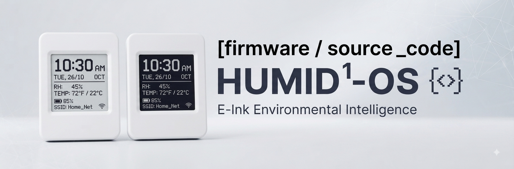

# HUMID1-OS Firmware (`source_code`)

> Welcome to the firmware source directory for **HUMID1-OS**, an ultra-low-power, cloud-integrated IoT hydrometer built for precision **cigar** and **tobacco humidor** monitoring. 

  

---

## 1. Hardware Target & Prerequisites
The firmware is strictly engineered to target the **Waveshare ESP32-S3-ePaper-1.54 (V2 Revision, SKU: 32298)** hardware platform. 
* **Microcontroller:** ESP32-S3-PICO-1-N8R8 SoC (Xtensa 32-bit LX7 dual-core processor at 240 MHz, 8MB Flash, 8MB PSRAM).
* **Display:** 1.54-inch 2-color (Black and White) e-Paper display (200x200 resolution).
* **Sensor:** SHTC3 Temperature & Humidity sensor (I2C address `0x70`).
* **Peripherals:** PCF85063 RTC, ES8311 audio codec, and an optional MicroSD card slot for audio sample catalog.

---

## 2. Build Environment & Setup
* **Supported IDEs:** Compatible with **Arduino IDE** and **Visual Studio Code (PlatformIO)**.
* **Partition Table:** A custom partition scheme is required to optimize flash memory allocation for OTA redundancy, application code, and SPIFFS/LittleFS storage.
* **Framework Configuration Note:** When configuring for the V2 board revision, ensure tool parameters match the hardware profile (e.g., selecting `OPI PSRAM` instead of `QSPI PSRAM` to match the 8MB PSRAM configuration).
### Conditional Build Flags
* `--NOAUDIOSUPPORT`: A conditional compilation flag that can be enabled to omit audio catalog integration and SD card dependencies for lightweight builds.

---

## 3. Critical Pinout & Power Management Configuration
To properly handle deep sleep cycles and prevent power loss when physical buttons are released, the firmware configures the following critical GPIO mappings:

| GPIO Pin | Role / Signal Name | Behavior & Configuration Notes |
| :--- | :--- | :--- |
| **GPIO17** | `vbat_power` | Battery power latch (active high; must be driven high at boot and frozen via `gpio_hold_en()` during deep sleep). |
| **GPIO6** | `epd_power` | Panel power pin (active low; driven low to power the panel during updates and high before sleep to cut idle draw). |
| **GPIO18** | `PWR Button` | Wakeup pin connected to the physical power button (configured as active-low with `INPUT_PULLUP`). |
| **GPIO4** | `BAT_ADC` | Battery voltage ADC pin, measuring `VBAT/2` through a resistor divider. |
| **GPIO47 / 48** | `I2C SDA / SCL` | Shared I2C bus connected to the `SHTC3` sensor (`0x70`), RTC, and audio codec. |

---

## 4. Firmware Architecture & Core Workflow
* **Duty Cycle Strategy:** The firmware utilizes an optimized **Wake-Read-Refresh-Sleep** workflow.  
The device spends the vast majority of its lifecycle in deep sleep, waking up at configured intervals (e.g., every 30 minutes) to poll sensors, update the e-Paper display statically, sync time via SNTP, and report telemetry.  
* **Provisioning:** Initial device setup uses **Bluetooth Low Energy (BLE)** pairing to securely transmit Wi-Fi credentials and claim the device via ThingsBoard auto-discovery using a secure serial or PIN code.  
* **Cloud Integration:** Telemetry data (temperature, relative humidity, battery health, and system metadata) is transmitted directly to a self-hosted **ThingsBoard** IoT backend.  
* **OTA Updates:** Managed via automated Over-The-Air deployment pipelines integrated directly through the ThingsBoard server during scheduled wake windows.  

---

**Humiditron-2026**  
Licenses: [MIT](LICENSE) (Code) | [CC BY 4.0](LICENSE-ASSETS) (Media Assets)  
*Co-architected with a touch of C.A.D. (Companion-Assisted Design)*  