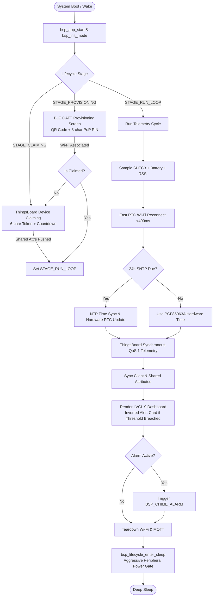

# HUMID1-OS User Application

[](https://github.com/espressif/esp-idf)
[](https://github.com/Humidyne-Labs/esp32-s3_bsp)
[](https://lvgl.io)
[](LICENSE)

The official **`HUMID1-OS`** production user application for the **Waveshare ESP32-S3 Touch-ePaper-1.54" V2** embedded hardware platform. Engineered for ultra-low-power environmental telemetry, dynamic server-driven attribute control, and seamless zero-touch IoT management via ThingsBoard.

[](https://tools.signupgenius.com/c/support-humid1-project)  
---

## 1. Hardware Platform Specifications

* **Target Board:** Waveshare ESP32-S3 Touch-ePaper-1.54" V2 (SKU: 32298)
* **SoC:** Espressif ESP32-S3-PICO-1-N8R8 (Xtensa 32-bit LX7 dual-core @ 240 MHz, 8 MB Flash, 8 MB PSRAM)
* **Display:** SSD1681 1.54" 200×200 1-bit Monochrome e-Paper Display (EPD)
* **Sensor:** Sensirion SHTC3 Relative Humidity & Temperature Sensor (I2C: `0x70`)
* **Real-Time Clock:** NXP PCF85063A Hardware RTC (I2C: `0x51`)
* **Audio:** Everest Semi ES8311 I2S Audio Codec + NS4168 Class-D Power Amplifier
* **Battery & Power:** Analog ADC voltage divider sensing (`GPIO 4`) with active LDO power latch hold (`GPIO 17`)

---

## 2. Architecture & Subsystems



---

## 3. Key Architectural Features

### 3.1 Unified Master Include Manifest
All peripheral drivers, hardware abstraction layers, and lifecycle engines are consolidated under the single umbrella header:
```cpp
#include "bsp/bsp.h"
```
No manual piecemeal inclusion of sub-drivers is required.

### 3.2 Persistent Stage State Engine
System lifecycle transitions are preserved across deep-sleep cycles in RTC Slow Memory via `bsp_lifecycle_get_stage()` and `bsp_lifecycle_set_stage()`:
* **`APP_STAGE_PROVISIONING` (0):** BLE GATT provisioning advertising with concurrent 116×116 QR code and 8-character Base57 PoP PIN.
* **`APP_STAGE_CLAIMING` (1):** Auto-generated 6-character claiming token published to ThingsBoard with on-screen countdown timer.
* **`APP_STAGE_RUN_LOOP` (2):** Ultra-fast telemetry acquisition, ThingsBoard MQTTS transaction, and low-power deep sleep stand-down.
* **`APP_STAGE_SHUTDOWN` (3):** Clean hardware power-off stand-down hook (`on_shutdown`) before LDO power latch drops.

### 3.3 Synthesized Audio Chime & Acoustic Alerts
The application connects to the BSP v1.4.0 synthesized notification framework (`bsp_audio_play_chime`):
* `BSP_CHIME_BOOT`: Ascending 4-tone bootup arpeggio (`C5 -> E5 -> G5 -> C6`).
* `BSP_CHIME_WAKE`: Fast rising wake cue (`G5 -> C6`).
* `BSP_CHIME_SLEEP`: Descending stand-down cadence (`C6 -> G5 -> E5`).
* `BSP_CHIME_SHUTDOWN`: Warm descending power-off tone (`G5 -> E5 -> C5`).
* `BSP_CHIME_ALARM`: High-urgency alternating warning warble (`1760 Hz / 880 Hz`) for critical threshold breaches.
* `BSP_CHIME_NOTIFY`: Dual-ping notification chirp (`1046 Hz -> 1318 Hz`) on Wi-Fi connection and claiming success.
* `BSP_CHIME_EVENT`: Tactile feedback click blip (`1200 Hz`) on user actions.

### 3.4 24-Hour Periodic SNTP Scheduling (Battery Optimization)
To prevent battery depletion from frequent network synchronization, SNTP is scheduled periodically:
* The system checks the last sync timestamp stored in RTC memory.
* Network SNTP synchronization (`bsp_time_sntp_sync`) only triggers every **24 hours** (`APP_SNTP_SYNC_INTERVAL_SEC`).
* Standard wake cycles rely exclusively on the **PCF85063A hardware RTC** and the **RTC Fast Reconnect Session Cache**, completing transactions in **<400 ms**.

### 3.5 Factory Reset Guard
Holding the onboard **BOOT button (GPIO 0)** for **>3 seconds** triggers an instant alert chime, wipes all NVS flash storage and fast Wi-Fi caches, sets the lifecycle stage to `APP_STAGE_PROVISIONING`, and reboots into BLE pairing mode.

### 3.6 Space Cat Zero-Power Persistent Shutdown Screen
When the device is powered off (via POWER button hold or ThingsBoard remote shutdown RPC):
1. The `on_shutdown` lifecycle hook executes clean MQTT and Wi-Fi disconnects.
2. Plays the warm descending `BSP_CHIME_SHUTDOWN` tone.
3. Decodes and renders **Space Cat** (`space_cat.png`) from the zero-copy MMAP flash storage partition (`S:`).
4. Forces a full hardware OTP waveform refresh (`bsp_display_wait_busy`) to permanently latch the image onto the bi-stable e-Paper display.
5. Drops the physical LDO battery power latch (`GPIO 17`), leaving the **Space Cat** graphic visibly retained indefinitely with **0 µA power draw** as proof of complete system power-off.

---


## 4. Building & Flashing

### 4.1 Prerequisites
* **ESP-IDF:** v6.1 (or v5.3+)
* **Target:** `esp32s3`

### 4.2 Build Firmware
```powershell
# In PowerShell with ESP-IDF environment exported:
. C:\esp\v6.1\esp-idf\export.ps1
idf.py set-target esp32s3
idf.py build
```

### 4.3 Flash to Target Hardware
```powershell
idf.py -p COM_PORT flash monitor
```

---

## 5. ThingsBoard Server Configuration

The application connects to the ThingsBoard server via secure MQTTS using the ESP-IDF System Certificate Bundle.

### 5.1 Server Connection & Provisioning Credentials
All server connection parameters are centrally configured in [`main/app_config.h`](file:///c:/Users/Matt/Documents/GitHub/humid1-os/Source_Code/humid1_os_cpp/main/app_config.h):
* **Host (`APP_TB_HOST`):** `"humid1.com"`
* **Port (`APP_TB_PORT`):** `8883` (MQTTS TLS)
* **Default URI (`APP_TB_DEFAULT_BROKER_URI`):** `"mqtts://humid1.com:8883"`
* **Provision Key (`APP_TB_PROVISION_KEY`):** `"joz5hqceqbkzzft3qzaf"`
* **Provision Secret (`APP_TB_PROVISION_SECRET`):** `"d9xpuylns0pdlk2w70hc"`

> [!TIP]
> **Flexible URI Handling:** The ThingsBoard client automatically sanitizes and normalizes the host URL. Supplying either a bare hostname (`"humid1.com"`) or a full URI (`"mqtts://humid1.com:8883"`) is supported out of the box.

### 5.2 Supported Remote RPCs
| Method | Description | Example Payload |
|---|---|---|
| `shutdown` / `powerOff` | Triggers clean system power-off & Space Cat latch | `{}` |
| `reboot` | Restarts device | `{}` |
| `ping` | Health-check ping-pong | `{}` |
| `beep` / `event` | Plays tactile click blip (`BSP_CHIME_EVENT`) | `{}` |
| `notify` / `chime` | Plays dual-ping notification chime (`BSP_CHIME_NOTIFY`) | `{}` |
| `alarm` / `alert` | Plays urgent threshold alarm warble (`BSP_CHIME_ALARM`) | `{}` |


---

## 📄 License

Licenses: [MIT](LICENSE)  

## 👥 Contributors

[](https://github.com/Humiditron/)
[](https://github.com/google-gemini/)

© 2026 **Humidyne-Labs**
